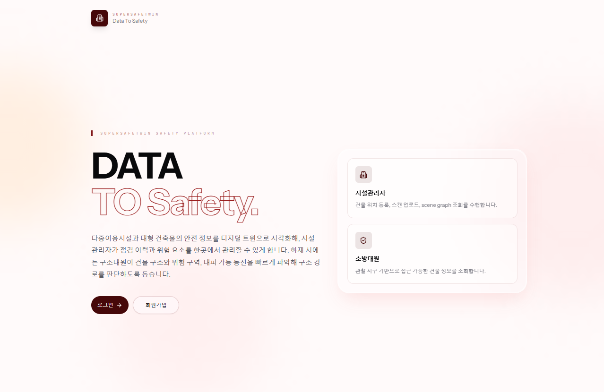
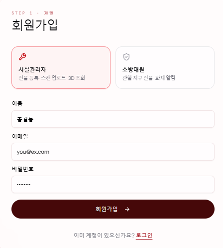
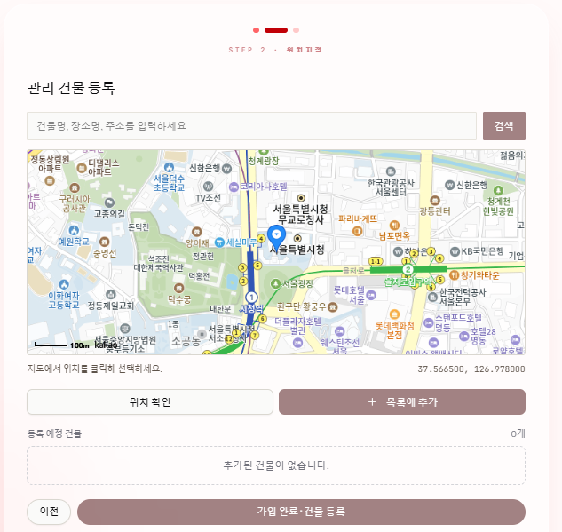
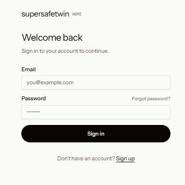
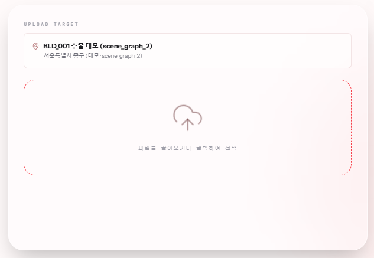
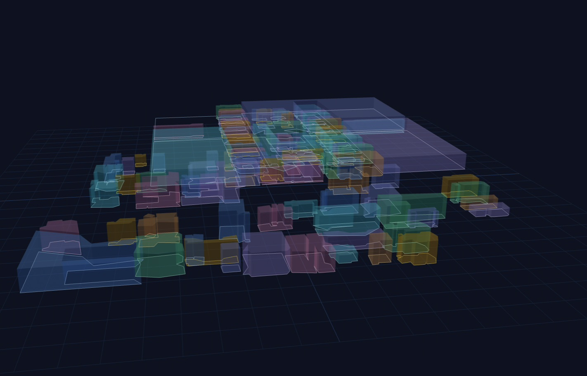
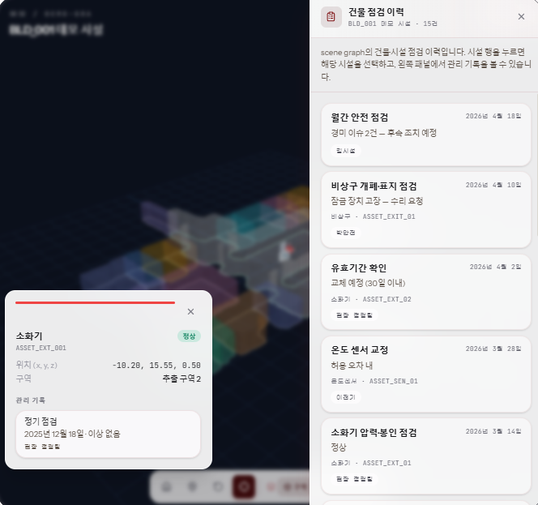
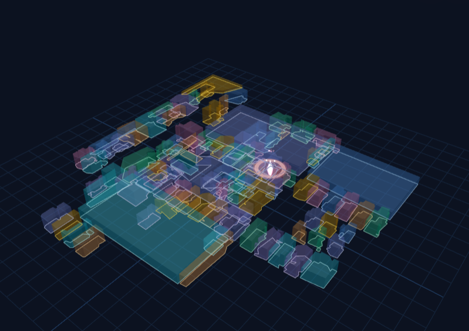
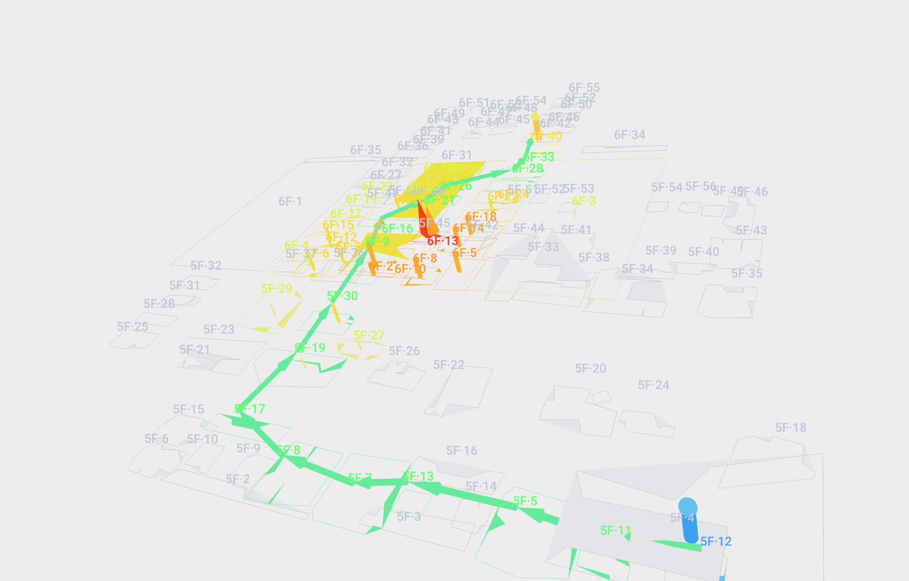

# Super Safe Twin : 3D HSSG 기반 세이프티 플랫폼
### Data To Safety

> 시설물 관리와 소방 대응의 패러다임 전환.  
> **3D HSSG**(Hierarchical Semantic Scene Graph) 기술을 통해 건축물 데이터를 정밀하게 구조화하고  
> 실시간 재난 대응 시각화를 제공합니다.

<br>



---

## 목차

1. [플랫폼 사용 단계](#01-플랫폼-사용-단계)
2. [핵심 이점](#02-핵심-이점)
3. [프론트엔드 구조 및 기술 사양](#03-프론트엔드-구조-및-기술-사양)

---

<br>

## 01. 플랫폼 사용 단계

플랫폼은 데이터의 유입부터 전술적 활용까지 **5가지 수직적 레벨(Floor)** 로 운영됩니다.


<br>

| Level | Name | 설명 |
|:---:|:---|:---|
| `01F` | **Data Acquisition** | 시설 관리자가 현장의 2D Scan 데이터를 업로드합니다. |
| `02F` | **3D-HSSG Generation** | AI 알고리즘이 데이터를 정밀한 Digital Twin으로 변환합니다. |
| `03F` | **Facility Management** | 3D 뷰어를 통해 건물 내부 설비를 입체적으로 관리합니다. |
| `04F` | **Strategic Sharing** | 관제 데이터를 소방·재난 대응팀과 실시간 동기화합니다. |
| `EVAC` | **Emergency Protocol** | 재난 발생 시 즉각적인 전술 모드(Tactical Mode)로 전환합니다. |
* 회원가입 화면



* 회원가입 화면 2 (시설관리자 - 관리 건물 선택 / 소방 및 재난 대응팀 - 관할 구역 선택)



* 로그인 화면



* 업로드 화면



* 뷰어 화면



* 시설 관리 화면



* 화재 조회 화면




* 최적 경로 탐색 화면




<br>

<details>
<summary><b>각 레벨 상세 설명 보기</b></summary>

<br>

**Level 01 — Data Acquisition**
- 모든 데이터의 진입점으로, 시스템 구축을 위한 Raw Data를 확보합니다.

**Level 02 — 3D-HSSG Generation**
- 건물의 가상 골조와 객체 간 계층적 세만틱 구조를 완성합니다.

**Level 03 — Facility Management**
- 배관, 전기 시설 등 비가시 영역을 가시화하여 정밀한 시설 모니터링을 수행합니다.

**Level 04 — Strategic Sharing**
- 유기적인 데이터 네트워크를 통해 통합 재난 대비망을 구축합니다.

**Level 05 — Emergency Protocol**
- 구조 대원을 위한 최단 생존 경로 및 위험 구역 데이터를 실시간으로 출력합니다.

</details>

<br>

---

## 02. 핵심 이점

<br>

**경량화된 정밀 구조**
> 2D 스캔 데이터만으로 객체 지향적 3D HSSG를 생성합니다.  
> 도입 비용을 획기적으로 절감하면서도 정밀도를 유지합니다.

**실시간 전술 가시성**
> 연기나 암흑으로 가려진 실제 현장에서도 투명한 공간 정보를 시각화합니다.  
> 대응팀의 시야와 안전을 확보합니다.

**구조적 무결성 (Structural Integrity)**
> 데이터 추출부터 관리까지 일관된 계층 구조를 유지합니다.  
> 재난 시 정보의 신뢰도를 보장합니다.


<br>

---

## 03. 프론트엔드 구조 및 기술 사양

### 기술 스택

| 분류 | 기술 |
|:---|:---|
| Framework | Next.js 16 (App Router), React 19, TypeScript 5 |
| 3D 렌더링 | Three.js 0.183, @react-three/fiber 9.5 |
| UI | Radix UI, Tailwind CSS v4, shadcn/ui |
| 폼 & 유효성 검사 | React Hook Form, Zod |
| 애니메이션 | Framer Motion |
| 아이콘 | Lucide React |
| HTTP | Axios |
| 패키지 매니저 | pnpm |

<br>

### 핵심 구현 상세

#### 1. 3D 씬 그래프 렌더링 — Three.js + React Three Fiber

`lib/scene-graph-skeleton/`에서 파싱된 HSSG 데이터를 `@react-three/fiber` 기반 캔버스에 렌더링합니다.  
건물의 구조적 자산(벽·천장·바닥·설비)을 각각 독립 Mesh로 분리하여 선택·하이라이트·툴팁을 지원합니다.

```
BuildingSceneCanvas        # R3F Canvas 진입점
├── SceneCameraController  # 카메라 뷰 전환 (평면도 / 투시)
├── StructuralAssetMesh    # 구조 자산 Mesh (선택 이벤트 처리)
├── PlacementSurface       # 자산 배치 평면
├── AssetSpot              # 설비 위치 마커
├── FireIncidentMarker     # 화재 발생 위치 표시
└── AssetHoverTooltip      # 자산 호버 툴팁
```

<br>

#### 2. 비상 대응 모드 — Emergency Protocol

`emergency-workspace-view.tsx`에서 화재 발생 시 전술 모드로 즉시 전환합니다.  
`ViewerFireIncidentsPanel`과 실시간 알림(`emergency-fire-notifications.tsx`)이 연동됩니다.

| Mode | 설명 |
|:---|:---|
| Normal | 시설 관리 모드 — 설비 점검 이력 및 자산 검색 |
| Emergency | 전술 모드 — 화재 위치 마커 + 실시간 사고 목록 활성화 |

<br>

#### 3. API 및 업로드 파이프라인

**3-1. 인증 (Authentication)**

```
POST /auth/signup   # 시설관리자: { email, password, name, job: "FACILITY_MANAGER" }
                    # 소방대원:   { email, password, name, job: "FIREFIGHTER", jurisdiction: { code, name } }
POST /auth/login    { email, password }
GET  /auth/me
```

**3-2. 건물 조회 및 씬 그래프**

```
GET  /buildings                              # 역할별 자동 필터링
GET  /buildings/{building_id}/scene-graph    # 최신 HSSG JSON 조회
POST /facility/buildings                     # 시설관리자 전용 건물 등록
```

**3-3. 파일 업로드 — 3단계 방식**

대용량 파일 전송 최적화를 위해 Presigned URL 방식을 사용합니다.

```
# Step 1 — URL 발급
POST /data-transforms/upload
Authorization: Bearer {token}
Body: { building_id, filename, content_type }
→ 반환: { task_id, upload_url }

# Step 2 — MinIO 직접 전송
PUT {upload_url}
Body: <file binary>

# Step 3 — 업로드 완료 신호 & 변환 시작
POST /data-transforms/{task_id}/complete-upload
→ 백그라운드 변환 시작 (202 Accepted)

# Step 4 — 변환 상태 polling
GET /data-transforms/{task_id}
→ { status: "PROCESSING" | "COMPLETED" | "FAILED", progress_percent }
```

**3-4. 공통 설정**

| 항목 | 값 |
|:---|:---|
| Base URL | `https://supersafetwin-backend.duckdns.org` (`NEXT_PUBLIC_API_URL`) |
| 인증 방식 | Bearer Token (모든 보호 경로 자동 포함) |
| HTTP 클라이언트 | Axios (`lib/api/client.ts`) |

<br>

#### 4. 프로젝트 디렉토리 구조

```
front/
├── app/                          # Next.js App Router 페이지
│   ├── page.tsx                  # 홈
│   ├── layout.tsx
│   ├── sign-in/                  # 로그인
│   ├── sign-up/                  # 회원가입
│   ├── upload/                   # 2D 스캔 데이터 업로드
│   ├── viewer/                   # 3D HSSG 뷰어
│   ├── facility/                 # 시설 목록 관리
│   ├── emergency/                # 비상·화재 대응
│   ├── my-page/                  # 마이페이지
│   └── api/                      # API 클라이언트 모듈
│       ├── auth.ts
│       ├── upload.ts
│       ├── viewer.ts
│       └── fire-incidents.ts
│
├── components/
│   ├── facility-building-viewer/ # Three.js 3D 뷰어 컴포넌트
│   │   ├── BuildingSceneCanvas.tsx
│   │   ├── StructuralAssetMesh.tsx
│   │   ├── AssetDetailPanel.tsx
│   │   ├── FireIncidentMarker.tsx
│   │   ├── ViewerSearchPanel.tsx
│   │   ├── ViewerInspectionHistoryPanel.tsx
│   │   └── ...
│   ├── facility/                 # 시설 목록·빌딩 관리 UI
│   ├── sign-up/                  # 멀티스텝 회원가입 플로우
│   ├── emergency-workspace-view.tsx
│   ├── emergency-fire-notifications.tsx
│   └── ui/                       # shadcn/ui 기본 컴포넌트
│
├── lib/
│   ├── scene-graph-skeleton/     # HSSG 핵심 파싱·연산 로직
│   │   ├── types.ts              # 씬 그래프 타입 정의
│   │   ├── assets.ts             # 자산 목록 추출
│   │   ├── structural-assets.ts  # 구조 자산(벽·천장·바닥) 처리
│   │   ├── zone-geometry.ts      # 공간 기하학 연산
│   │   ├── wall-orientation.ts   # 벽 방향 분류
│   │   ├── camera-views.ts       # 카메라 프리셋 뷰
│   │   ├── coordinates.ts        # 좌표 변환
│   │   ├── inspection-history.ts # 점검 이력
│   │   └── search.ts             # 자산 검색
│   ├── fire-incidents/           # 화재 사고 데이터 레이어
│   ├── facility/                 # 빌딩 목록 API 연동
│   ├── api/client.ts             # Axios 인스턴스
│   ├── auth/storage.ts           # 인증 토큰 스토리지
│   └── utils.ts
│
└── hooks/
    ├── use-facility-buildings.ts # 빌딩 목록 훅
    ├── use-require-job.ts        # 직종 인증 가드
    └── use-toast.ts
```

<br>

---

<div align="center">

© 2026 Super Safe Twin. All Rights Reserved.

</div>
